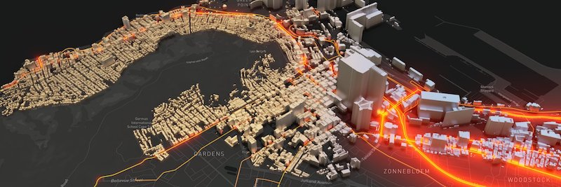
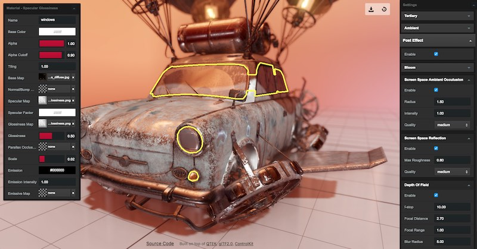
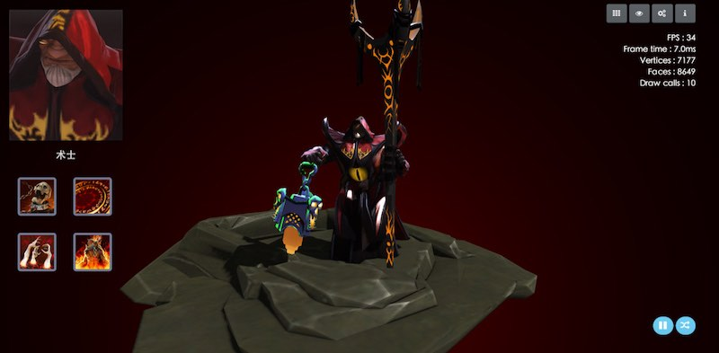

<h1>  ClayGL</h1>


[](https://github.com/pissang/claygl)
[](https://circleci.com/gh/pissang/claygl)

ClayGL is a type friendly WebGL graphic library for building scalable Web3D applications.

It's easy to use, configurable for high-quality graphics. Benefit from the modularity and tree shaking, it can be scaled down to 22k(gzipped) for a basic 3D application.

<ul>
<li style="display:inline-block;"><a href="https://github.com/pissang/claygl/releases">Download</a></li>
<li style="display:inline-block;"><a href="http://docs.claygl.xyz/api">API</a></li>
<li style="display:inline-block;"><a href="http://examples.claygl.xyz">Examples</a></li>
</ul>

## Projects

<p>
<a href="https://github.com/ecomfe/echarts-gl" target="_blank">

</a><a href="https://github.com/pissang/clay-viewer" target="_blank">

</a><a href="https://github.com/pissang/dota2hero" target="_blank">


</a>
<div style="clear: both;">
</p>

## Quick Start

##### Create a rotating cube

```html
<!DOCTYPE html>
<html lang="en">
  <head>
    <script src="lib/claygl.js"></script>
  </head>
  <body>
    <canvas id="main"></canvas>
    <script>
      const app = new clay.App3D('#main', {
        width: window.innerWidth,
        height: window.innerHeight
      });
      // Create camera
      const camera = app.createCamera([0, 2, 5], [0, 0, 0]);

      // Create a RED cube
      const cube = app.createCube({
        color: '#f00'
      });

      // Create light
      const mainLight = app.createDirectionalLight([-1, -1, -1]);

      app.loop((frameTime) => {
        cube.rotation.rotateY(frameTime / 1000);
      });
    </script>
  </body>
</html>
```

#### Minimum bundle example

This example is about 22k(gzipped) after bundled by webpack 4.0. It draws a triangle on the screen.

```js
import { Renderer, GeometryBase, Shader, Material, glsl } from 'claygl';

const vs = new Shader.Vertex({
  attributes: {
    position: Shader.attribute('vec3', 'POSITION')
  },
  main: glsl`
void main() {
  gl_Position = vec4(position, 1.0);
}`
});
const fs = new Shader.Fragment({
  uniforms: {
    color: Shader.uniform('rgb', 'red')
  },
  main: glsl`
void main() {
  gl_FragColor = vec4(color, 1.0);
}
`
});

const renderer = new Renderer({
  canvas: document.getElementById('main')
});
renderer.resize(400, 400);

const geometry = new GeometryBase();
const positionAttrib = geometry.createAttribute('position', 'float', 3);
// Add triangle vertices to position attribute.
positionAttrib.fromArray([
  [-0.5, -0.5, 0],
  [0.5, -0.5, 0],
  [0, 0.5, 0]
]);

const material = new Material(new Shader(vs, fs));
// 'color' have correct type here.
material.set('color', 'red');

renderer.renderPass([{ geometry, material }]);
```

### FBX to glTF2.0 Converter

[Get it](https://github.com/pissang/claygl/blob/master/tools/fbx2gltf.py)

Needs [python3.3](https://www.python.org/download/releases/3.3.0/) and [FBX SDK 2018.1.1](http://usa.autodesk.com/adsk/servlet/pc/item?siteID=123112&id=26416130).

```
usage: fbx2gltf.py [-h] [-e EXCLUDE] [-t TIMERANGE] [-o OUTPUT]
          [-f FRAMERATE] [-p POSE] [-q] [-b]
          file

FBX to glTF converter

positional arguments:
  file

optional arguments:
  -h, --help            show this help message and exit
  -e EXCLUDE, --exclude EXCLUDE
            Data excluded. Can be: scene,animation
  -t TIMERANGE, --timerange TIMERANGE
            Export animation time, in format
            'startSecond,endSecond'
  -o OUTPUT, --output OUTPUT
            Ouput glTF file path
  -f FRAMERATE, --framerate FRAMERATE
            Animation frame per second
  -p POSE, --pose POSE  Start pose time
  -q, --quantize        Quantize accessors with WEB3D_quantized_attributes
            extension
  -b, --binary          Export glTF-binary
  --beautify            Beautify json output.
  --noflipv             If not flip v in texcoord.
```

Input:

- FBX
- COLLADA
- OBJ

Output:

- Scene hierarchy
- Mesh and camera
- PBR material
- Texture
- Skin
- Animation
